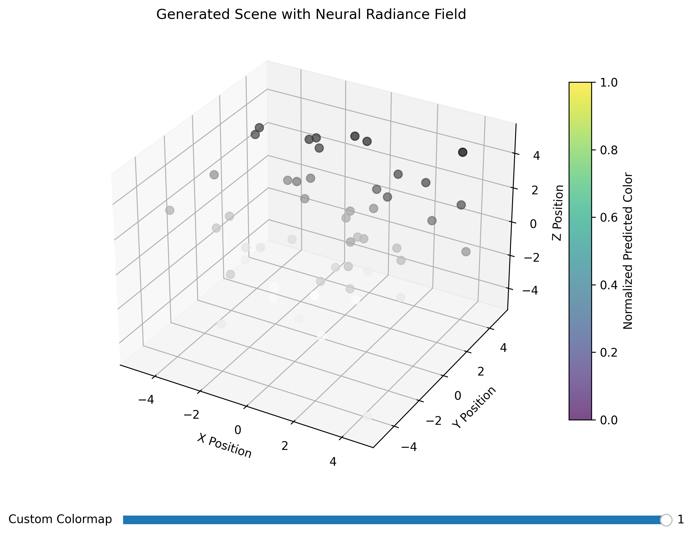

# Neural Radiance Field (NeRF) Toy Example Visualization
This repository contains a Python script for visualizing the results of a Neural Radiance Field (NeRF) model. NeRF is a technique used for synthesizing novel views of a 3D scene using neural networks. This script generates and visualizes a 3D scene with synthetic camera poses, where each point in the scene is assigned a color value predicted by the NeRF model.



# Purpose
The purpose of this code is to demonstrate the basic workflow of training a NeRF model and visualizing the generated 3D scene. It includes the following components:

Generating synthetic camera pose data.
Defining a NeRF neural network model architecture.
Training the NeRF model using the generated camera pose data.
Generating and visualizing a new view of the scene.
Code Components
Synthetic Data Generation: The function generate_synthetic_data() generates random camera poses within a defined range, simulating the positions from which images are taken.

NeRF Model: The NeRF class defines a simple feedforward neural network that takes 3D coordinates (camera poses) as input and outputs predicted colors. The model consists of three fully connected layers with ReLU activations.

Training Loop: The code contains a training loop that iterates over a specified number of epochs. In each epoch, the NeRF model predicts colors for the given camera poses, calculates the mean loss, and updates the model's parameters using the Adam optimizer.

New View Generation and Visualization: After training, a new view of the scene is generated using a specified camera pose. The predicted colors are normalized and visualized as a scatter plot with colors representing the normalized predicted color values.

# Key Features
* Generates synthetic camera poses within a 3D space.
* Trains a NeRF model to predict color values for each point in the scene.
* Visualizes the generated scene using a 3D scatter plot and a surface plot.
* Allows interactive customization of the colormap using a slider.
* Displays annotations on hover to show color information for each scatter point.

# Usage
Create Virtual Environment

``` conda create --name env ```

Activate Virtual Environment

``` source activate env ```

Install the required libraries if not already installed:

``` pip3 install -r requirements.txt ```

Run the code:

``` python3 main.py ```
 
 The generated 3D visualization will be displayed. You can interact with the visualization by hovering over scatter points to view color annotations and using the slider to customize the colormap.

#  Note
This code serves as an educational example and does not cover all the complexities involved in training a NeRF model for real-world applications. More advanced NeRF variants, data preparation, loss functions, and optimizations would be necessary for practical use cases.

Feel free to modify and extend this code to experiment with different NeRF architectures, datasets, and visualization techniques.

# License
This project is licensed under the [MIT License](https://opensource.org/licenses/MIT).